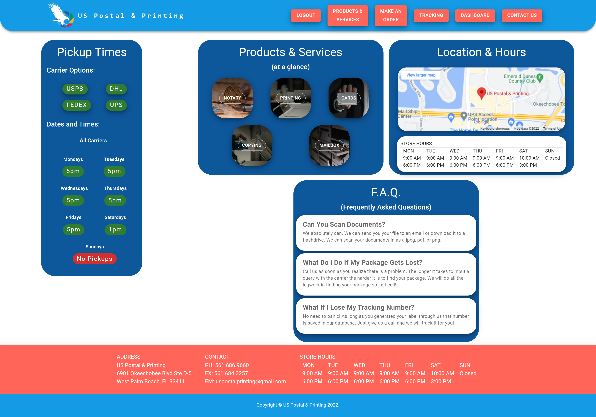

<p id="readme-top"></p>

[](./LICENSE) [](https://github.com/Mateo-Wallace/US-Postal-Printing/graphs/contributors) [](https://github.com/Mateo-Wallace/US-Postal-Printing/issues) [](https://github.com/users/Mateo-Wallace/projects/4/views/1)

# US Postal & Printing

## Description

US Postal & Printing is a full stack MERN web app that serves as an information page for the company US Postal & Printing. The user is able to see the services the company provides, track packages, make orders, contact the store, and save orders and packages to their dashboard. For more information check out the [PowerPoint](https://docs.google.com/presentation/d/11zaugrKaa3uVzKBkMWfaP2I_4uUIggcZltKR_tsWFmo/edit?usp=sharing).

The project utilizes an Express backend, GraphQL Api, mongoDB database, and a third party Api.

While building this project we learned to:

- Style a page with [Material UI](https://mui.com/), a css component library
- Make a proxy server using [Axios](https://axios-http.com/) in order to circumvent CORS errors
- Authenticate users via [JSON Web Tokens](https://jwt.io/)
- Link to another page without reloading the website using [React](https://reactjs.org/)

### MERN Stack

[](https://www.mongodb.com/) [](http://expressjs.com/) [](https://reactjs.org/) [](https://nodejs.org/en/)

### Tech

[](https://www.apollographql.com/) [](https://graphql.org/) [](https://mongoosejs.com/) [](https://mui.com/) [](https://axios-http.com/) [](https://jwt.io/) [](https://developer.mozilla.org/en-US/docs/Web/JavaScript) [](https://developer.mozilla.org/en-US/docs/Web/CSS) [](https://developer.mozilla.org/en-US/docs/Glossary/HTML5)

## Table of Contents

- [Installation](#installation)
- [Usage](#usage)
- [Contributing](#contributing)
- [License](#license)
- [Contact & Contributors](#contact-and-contributors)

## Installation

US Postal & Printing is a deployed web application. Most users must simply navigate to [us-postal-printing.herokuapp.com/](https://us-postal-printing.herokuapp.com/)



Should you wish to download the project locally you must:

1. Open your terminal and clone the repo

   ```
   SSH:
   git clone git@github.com:Mateo-Wallace/US-Postal-Printing.git

   HTTPS:
   git clone https://github.com/Mateo-Wallace/US-Postal-Printing.git
   ```

2. Install NPM packages
   ```
   npm i
   ```
3. Rename the `.env.example` file in `/server` to `.env` and change the variables
   ```
   SHIPPO_AUTH = "ShippoToken <YOUR API KEY FROM SHIPPO>"
   ```

<p align="right">(<a href="#readme-top">back to top</a>)</p>

## Usage

When navigating to the website you will be greeted with the home page. This page displays relevant services, carrier pickup times, and business hours. At the top of the screen you will see a NavBar. Clicking on the following links will result in the subsequent action:

- Logout: Cancel user session
- Products & Services: In depth information on available services
- Make An Order: Form with various inputs, information is saved to database
- Tracking: Type in a tracking number for USPS, UPS, Fedex, or DHL. If you are logged in you may also save this number to your packages in Dashboard
- DashBoard: Relevant data to the current logged in user
   - View My Packages: Shows saved packages and allows user to update and delete
   - View My Orders: Shows saved orders and allows user to update and delete
   - Edit My Account: Shows user data and allows user to update and delete
- Contact Us: Form that is emailed to the business owner on submit

<p align="right">(<a href="#readme-top">back to top</a>)</p>

## Contributing

If you have a suggestion that would make the repo better, please fork the repo and create a pull request. You can also simply open an issue with the tag "enhancement". Don't forget to give the project a star! Thanks again!

1. Fork the Project
2. Create your Feature Branch (git checkout -b feature/AmazingFeature)
3. Commit your Changes (git commit -m 'Add some AmazingFeature')
4. Push to the Branch (git push origin feature/AmazingFeature)
5. Open a Pull Request

<p align="right">(<a href="#readme-top">back to top</a>)</p>

## License

Distributed under the MIT License. See [LICENSE](./LICENSE) for more information.

<p align="right">(<a href="#readme-top">back to top</a>)</p>

## Contact And Contributors

For any further questions feel free to contact us via:

- Project Link: [github.com/Mateo-Wallace/US-Postal-Printing](https://github.com/Mateo-Wallace/US-Postal-Printing)

- Dylan Crowley - [GitHub](https://github.com/dcrowdev) - [Email](mailto:dcrowdev1025@gmail.com) - [LinkedIn](https://www.linkedin.com/in/dylan-crowley-3974b8252/)

- Benjamin Fein - [GitHub](https://github.com/Bfunk54) - [Email](mailto:ben_fein@icloud.com) - [LinkedIn](https://www.linkedin.com/in/benjamin-fein-5a73b2242/)

- Sangki Jun - [GitHub](https://github.com/sangki810) - [Email](mailto:sangki810@gmail.com) - [LinkedIn](https://www.linkedin.com/in/sangki-jun-8a6a5310b/)

- Mateo Wallace - [GitHub](https://github.com/Mateo-Wallace) - [Email](mailto:mateo.t.wallace@gmail.com) - [LinkedIn](https://www.linkedin.com/in/mateo-wallace-57931b254/)

<p align="right">(<a href="#readme-top">back to top</a>)</p>